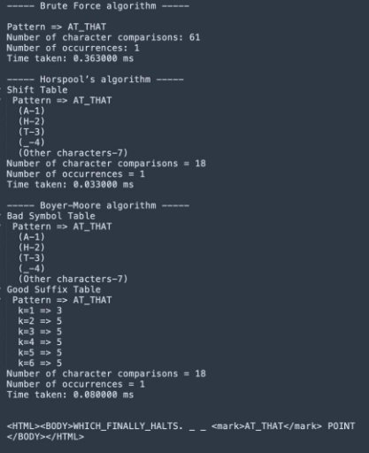

# **String Matching Algorithms Comparison**

## **Purpose of Project** 

This repository houses an experiment that compares the efficiency and effectiveness of three string matching algorithms: 

1. Brute-force String Matching 
1. Horspool’s Algorithm 
1. Boyer-Moore Algorithm 

The goal is to understand each algorithm's strengths, weaknesses, behaviors under different conditions, and suitability for various tasks. This project also investigates how factors like pattern repetitions and pattern length can influence the algorithms' execution time. 

### **Brute-Force String Matching** 

A simple method for pattern matching, it compares the pattern with all possible substrings of the text until a match is found. The **mark\_pattern** function carries out the search and marks the pattern. Matched patterns are written to the output file surrounded by HTML tags. 

### **Horspool's Algorithm** 

This efficient string matching algorithm uses a shift table to determine the number of positions to shift the pattern for the next comparison. The **shiftTables** function creates the shift table. **horspoolSearch** function carries out the search by comparing the pattern with the text. It iterates through the text, comparing the pattern to substrings in the text. If a match is not found, it shifts the pattern based on the shift table. **searchPatterns** function performs pattern searching for multiple patterns within a given text. 

### **Boyer-Moore Algorithm** 

A powerful string matching algorithm that performs pattern matching in a backward manner. It uses three tables: shift table, bad character table, and good suffix table. Functions **goodSuffixTable**, **badCharTable**, and **shiftTable** generate these tables. **goodSuffixTable** calculates the suffix values of the pattern, **badCharTable** creates a table that stores the rightmost occurrence index of each character in the pattern, and **shiftTable** calculates and stores the shift distances for each character. 

### **Execution** 

The main function reads the contents of the **input2.html** file into a text array, defines **output.html** as the output file, and defines an array of patterns for the search. It iterates over each pattern, calling the **mark\_pattern** function for each. Inside the **mark\_pattern** function, the occurrences of the pattern are marked in the output file. 

## **Time Complexity of String Matching Algorithms** 

### **Horspool's Algorithm** 

Time complexity is O(n+m). Constructing the shift table takes O(m) time, where m is the pattern length. The main search loop iterates through the text once, comparing characters with the pattern. In the worst case, the loop runs n times, where n is the text length. Comparisons and shifts inside the loop are done in constant time. 

### **Boyer-Moore Algorithm** 

Time complexity is O(n\*m). Constructing the shift table and the bad character table each take O(m) time, where m is the pattern length. Constructing the suffix arrays and good suffix table take O(m) time. The main search loop iterates through the text, comparing characters with the pattern from right to left. In the worst case, the loop performs m character comparisons at n-m+1 positions, where n is the text length. 

### **Brute-Force String Matching** 

Time complexity is O(n-m+1\*m). The code reads the text file into memory, which takes O(n) time, where n is the file size. The pattern matching loop iterates through the text file checking for matches with the pattern. In the worst case, the loop runs n-m+1 times, where n is the text length and m is the pattern length. 

||Horspool |Boyer-Moore |Brute Force |
| :- | - | - | - |
|Time complexity |O(n+m) |O(n\*m) |O(n\*m) |

## **Deciding the Patterns for HTML Files with English Text** 

- **One-Word Pattern:** One-word patterns like “they” that consist ofseveral characters and can be found frequently in the text. 
- **Multi-Word Pattern:** This type of pattern like “after the breakfast” is less frequently found in the text, usually consisting of a few words or a sentence. 
- **Rarely or Never Found Patterns:** These types of patterns like “unicorns in the pink sea” are rarely or never found in the text. 
- **Patterns Containing Random Characters:** Patterns like “abcdefgh” consisting of randomly selected characters and not found in the text.

Considering the above, it was decided to choose the following patterns to test 3 different HTML files with 3 different algorithms: 
| Pattern Type                      | Example                   |
| --------------------------------- | ------------------------- |
| One-word pattern                  | "they"                    |
| Multi-word pattern                | "after the breakfast"     |
| Rarely or Never Found Pattern     | "unicorns in the pink sea"|
| Patterns Containing Random Characters | "abcdefgh"            |

## **Deciding the HTML Files with English Text** 

In this project, it was selected 3 different HTML files containing world- famous novels to test the algorithms. Firstly, such texts often have complex and rich language usage, allowing to test how this algorithms perform on various language structures and word usages. Second, these novels are usually quite long, allowing to see how this algorithms work on large datasets. Third, thetexts of these novels are generally well-structured and neat, which allows this algorithms to work properly. 

### **Results for the first sample HTML file with text:** 

- Size of HTML file: 1,43 MB 
- URL from which the HTML file was taken: [https://www.gutenberg.org/files/2701/2701-h/2701-h.htm ](https://www.gutenberg.org/files/2701/2701-h/2701-h.htm)
- Content type of HTML file: Novel of Moby Dick by Herman Melville 
- The language of the content in the HTML file: English 
- Character set of HTML file: UTF-8 

For pattern “they”: 

||Number of Comparisons |Number of Occurrences |Running time |
| :- | :- | :- | :- |
|Brute-force string matching |1640158 |589 |36\.091000 ms |
|Horspool’s algorithm |580421 |589 |184\.46500 0 ms |
|Boyer-Moore algorithm |421150 |589 |657\.10400 0 ms |

For pattern “after the breakfast”: 

||Number of Comparisons |Number of Occurrences |Running time |
| :- | :- | :- | :- |
|Brute-force string matching |1585932 |0 |44\.285000 ms |
|Horspool’s algorithm |122441 |0 |1\.171000 ms |
|Boyer-Moore algorithm |132191 |0 |1\.809000 ms |

For pattern “unicorns in the pink sea”:

||Number of Comparisons |Number of Occurrences |Running time |
| :- | :- | :- | :- |
|Brute-force string matching |1540734 |0 |31\.058000 ms |
|Horspool’s algorithm |121020 |0 |1\.045000 ms |
|Boyer-Moore algorithm |135267 |0 |1\.884000 ms |

For pattern “abcdefgh”: 

||Number of Comparisons |Number of Occurrences |Running time |
| :- | :- | :- | :- |
|Brute-force string matching |1585949 |0 |38\.582000 ms |
|Horspool’s algorithm |19869 |0 |2\.161000 ms |
|Boyer-Moore algorithm |220911 |0 |2\.491000 ms |

### **Results for the second sample HTML file with text:** 

- Size of HTML file: 1.2 MB 
- URL from which the HTML file was taken: [https://www.gutenberg.org/files/70776/70776-h/70776-h.htm ](https://www.gutenberg.org/files/70776/70776-h/70776-h.htm)
- Content type of HTML file: The curse of Clifton: or, the widowed bride by Southworth 
- The language of the content in the HTML file: English 
- Character set of HTML file: UTF-8 

For pattern “they”: 

||Number of Comparisons |Number of Occurrences |Running time |
| :- | :- | :- | :- |
|Brute-force string matching |1390104 |391 |43\.559000 ms |
|Horspool’s algorithm |2481 |391 |0\.298000 ms |
|Boyer-Moore algorithm |3869 |391 |0\.640000 ms |

For pattern “after the breakfast”: 

||Number of Comparisons |Number of Occurrences |Running time |
| :- | :- | :- | :- |
|Brute-force string matching |1360420 |0 |16\.272000 ms |
|Horspool’s algorithm |689 |0 |0\.113000 ms|
|Boyer-Moore algorithm |107543 |0 |0\.741000 ms |

For pattern “unicorns in the pink sea”: 

||Number of Comparisons |Number of Occurrences |Running time |
| :- | :- | :- | :- |
|Brute-force string matching |1313359 |0 |11\.264000 ms |
|Horspool’s algorithm ||0 ||
|Boyer-Moore algorithm |102635 |0 |0\.807000 ms |

For pattern “abcdefgh”: 

||Number of Comparisons |Number of Occurrences |Running time |
| :- | :- | :- | :- |
|Brute-force string matching |1360125 |0 |16\.276000 ms |
|Horspool’s algorithm |127078 |0 |0\.128000 ms |
|Boyer-Moore algorithm |188855 |0 |1\.097000 ms |

### **Results for the third sample HTML file with text:** 

- Size of HTML file: 1.4 MB 
- URL from which the HTML file was taken: [https://www.gutenberg.org/files/2554/2554-h/2554-h.htm ](https://www.gutenberg.org/files/2554/2554-h/2554-h.htm)
- Content type of HTML file: Crime and Punishment, by Fyodor Dostoevsky 
- The language of the content in the HTML file: English 
- Character set of HTML file: UTF-8 

For pattern “they”: 

||Number of Comparisons |Number of Occurrences |Running time |
| :- | :- | :- | :- |
|Brute-force string matching |1554216 |603 |17\.943000 ms |
|Horspool’s algorithm |389524 |603 |1\.98465 ms |
|Boyer-Moore algorithm |403238 |603 |2\.484000 ms |

For pattern “after the breakfast”: 

||Number of Comparisons |Number of Occurrences |Running time |
| :- | :- | :- | :- |
|Brute-force string matching |1518858 |0 |16\.665000 ms |
|Horspool's algorithm |7986 |0 |0\.16600 ms |
|Boyer-Moore algorithm |122903 |0 |0\.807000 ms |

For pattern “unicorns in the pink sea”: 

||Number of Comparisons |Number of Occurrences |Running time |
| :- | :- | :- | :- |
|Brute-force string matching |1487145 |0 |19\.355000 ms |
|Horspool’s algorithm |79799 |0 |0\.509000 ms |
|Boyer-Moore algorithm |123775 |0 |0\.878000 ms |

For pattern “abcdefgh”: 

||Number of Comparisons |Number of Occurrences |Running time |
| :- | :- | :- | :- |
|Brute-force string matching |1518732 |0 |18\.335000 ms |
|Horspool’s algorithm |149413 |0 |1\.96000 ms |
|Boyer-Moore algorithm |209262 |0 |1\.428000 ms |

## **Deciding the HTML files with random bit- strings and Their Patterns** 

For the files of the second type of this project, it was created 3 different HTML files consisting of random bit sequences with 4-bit, 64-bit and ungrouped bits. 

- **Short and Regular Pattern:** A pattern that shows how fast the algorithm can process short, regular bit strings and is usually predictedto be found frequently in text. 
- **Short and Irregular Pattern:** Indicates how quickly the algorithm can process short and irregular bit strings, and a pattern that can be foundless frequently in text. 
- **Long and Regular Pattern:** A pattern that is less common in text andcan often take more time, showing how quickly the algorithm can process long, regular sequences of bits. 
- **Long and Irregular Pattern:** The pattern that is rarely found in text and usually takes the most time, showing how quickly the algorithm can process long and irregular bit strings. 

Considering the above, it was decided to choose the following patterns to test 3 different HTML files with 3 different algorithms: 

|Short and Regular Pattern |*“1010”* |
| - | - |
|Short and Irregular Pattern |*“1101”* |
|Long and Regular Pattern |*“1111111111111111111111 11”* |
|Long and Irregular Pattern |*"1101101001011101101010 01"* |

### **Results for the first sample HTML file with bit-strings:** 

For pattern “1010”: 

||Number of Comparisons |Number of Occurrences |Running time |
| :- | :- | :- | :- |
|Brute-force string matching |1504899 |52620 |19\.604000 ms |
|Horspool’s algorithm |284178 |52620 |1\.865000 ms |
|Boyer-Moore algorithm |376764 |52620 |2\.080000 ms |

For pattern “1101”: 

||Number of Comparisons |Number of Occurrences |Running time |
| :- | :- | :- | :- |
|Brute-force string matching |1504887 |58075 |19\.786000 ms |
|Horspool’s algorithm |284391 |58075 |1\.879100 ms |
|Boyer-Moore algorithm |376776 |58075 |2\.214000 ms |

For pattern “111111111111111111111111”:

||Number of Comparisons |Number of Occurrences |Running time |
| :- | :- | :- | :- |
|Brute-force string matching |1504867 |0 |19\.400000 ms |
|Horspool’s algorithm |61346 |0 |0\.360000 ms |
|Boyer-Moore algorithm |62703 |0 |0\.479000 ms |

For pattern “110110100101110110101001”: 

||Number of Comparisons |Number of Occurrences |Running time |
| :- | :- | :- | :- |
|Brute-force string matching |1504867 |0 |20\.577000 ms |
|Horspool’s algorithm |60090 |0 |0\.431000 ms |
|Boyer-Moore algorithm |62773 |0 |0\.674000 ms |

### **Results for the second sample HTML file withbit-strings:** 

For pattern “1010”: 

||Number of Comparisons |Number of Occurrences |Running time |
| :- | :- | :- | :- |
|Brute-force string matching |1290393 |31573 |15\.715000 ms |
|Horspool’s algorithm |301543 |31573 |1\.564500 ms |
|Boyer-Moore algorithm |326197 |31573 |1\.796000 ms |

For pattern “1101”: 

||Number of Comparisons |Number of Occurrences |Running time |
| :- | :- | :- | :- |
|Brute-force string matching |1290377 |34747 |15\.891000 ms |
|Horspool’s algorithm |301592 |34747 |1\.579000 ms |
|Boyer-Moore algorithm |326120 |34747 |1\.787000 ms |

For pattern “111111111111111111111111”: 

||Number of Comparisons |Number of Occurrences |Running time |
| :- | :- | :- | :- |
|Brute-force string matching |1290357 |0 |16\.344000 ms |
|Horspool’s algorithm |46893 |0 |0\.356000 ms |
|Boyer-Moore algorithm |53761 |0 |0\.457000 ms |

For pattern “110110100101110110101001”: 

||Number of Comparisons |Number of Occurrences |Running time |
| :- | :- | :- | :- |
|Brute-force string matching |1290357 |0 |15\.829000 ms |
|Horspool’s algorithm |47123 |0 |0\.378230 ms |
|Boyer-Moore algorithm |54434 |0 |0\.427000 ms |

### **Results for the third sample HTML file with bit-strings:** 

For pattern “1010”: 

||Number of Comparisons |Number of Occurrences |Running time |
| :- | :- | :- | :- |
|Brute-force string matching |1444379 |49312 |17\.540000 ms |
|Horspool’s algorithm |301024 |49312 |1\.454321 ms |
|Boyer-Moore algorithm |361292 |49312 |1\.922000 ms |

For pattern “1101”: 

||Number of Comparisons |Number of Occurrences |Running time |
| :- | :- | :- | :- |
|Brute-force string matching |1444378 |55079 |16\.876000 ms |
|Horspool’s algorithm |289642 |55079 |1\.975420 ms |
|Boyer-Moore algorithm |361277 |55079 |2\.009000 ms |

For pattern “111111111111111111111111”: 

||Number of Comparisons |Number of Occurrences |Running time |
| :- | :- | :- | :- |
|Brute-force string matching |1444357 |0 |13\.515000 ms |
|Horspool’s algorithm |15350 |0 |0\.179000 ms |
|Boyer-Moore algorithm |60181 |0 |0\.538000 ms |

For pattern “110110100101110110101001”: 

||Number of Comparisons |Number of Occurrences |Running time |
| :- | :- | :- | :- |
|Brute-force string matching |1444358 |0 |17\.709000 ms |
|Horspool’s algorithm |16490 |0 |0\.148440 ms |
|Boyer-Moore algorithm |60208 |0 |0\.473000 ms |

### **Results for another text provided below:** 

**Text:** `<HTML><BODY>WHICH_FINALLY_HALTS. _ _ AT_THAT POINT </BODY></HTML>`

**Pattern:** AT\_THAT 

||Number of Comparisons |Number of Occurrences |Running time|
| :- | :- | :- | - |
|Brute-force string matching |61 |1 |0\.088000 ms|
|Horspool’s algorithm |18 |1 |0\.087000 ms|
|Boyer-Moore algorithm |18 |1 |0\.288000 ms|

## **Conclusion** 

Testing with various patterns and HTML files highlighted the Brute-Force algorithm's relative inefficiency compared to Horspool and Boyer-Moore algorithms. The Horspool algorithm generally outperformed Boyer-Moore, albeit by a small margin. An interesting anomaly was that Brute-Force performed the fastest for frequently occurring words like "they". This highlights a cost for the other two algorithms when numerous matches are present in the text. 

In summary, while Brute-Force offers simplicity, it suffers in efficiency due to its method of checking each character individually. The Boyer-Moore algorithm emerged as the most efficient, leveraging "bad character" and "good suffix" rules for superior average and best-case time complexities. However, the Horspool algorithm presented some challenges with large file sizes. Consequently, the Boyer-Moore algorithm is recommended for large-scale sequence matching problems due to its significant performance improvements. 

## **References** 

[https://www.geeksforgeeks.org/brute-force-approach-and-its-pros-and- cons](https://www.geeksforgeeks.org/brute-force-approach-and-its-pros-and-cons/)[/ https://www.geeksforgeeks.org/boyer-moore-algorithm-for-pattern- searching](https://www.geeksforgeeks.org/boyer-moore-algorithm-for-pattern-searching/)[/ https://www.gutenberg.org/ ](https://www.gutenberg.org/)
